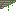

# d.Compose
Written for the GameDev.tv Game jam 2022: https://itch.io/jam/gamedevtv-jam-2022

| Sprite | ID | Desc |
|--------|----|------|
| [blank] | `##` | Blank Space |
| [player] | `%%` | Player character |
|  | `d1` | Decor 1 |
|  | `d2` | Decor 2 |
|  | `b1` | Block 1 |
|  | `pl` | Platform left |
|  | `pm` | Platform right |
|  | `pr` | Platform mid |