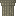

# d.Compose
Started during the GameDev.tv Game jam 2022: https://itch.io/jam/gamedevtv-jam-2022

Original Theme: Death is only the beginning

| Sprite | ID | Desc |
|--------|----|------|
| [blank] | `##` | Blank Space |
| [player] | `%%` | Player character |
|  | `d1` | Decor 1, thin tall mushroom |
|  | `d2` | Decor 2, wide mushroom |
|  | `b1` | Block 1, convertable stone/metal block? |
|  | `b2` | Block 2, alt version, converted. |
|  | `b3` | Block 3, unconvertable grass base. |
|  | `b4` | Block 4, dirt for fill under grass. |
|  | `pl` | Platform left |
|  | `pm` | Platform right |
|  | `pr` | Platform mid |
|  | `tb` | Platform left |
|  | `tm` | Platform right |
|  | `tt` | Platform mid |

Need to add:
- Other grass tiles, sides, bottom?
- Water?
